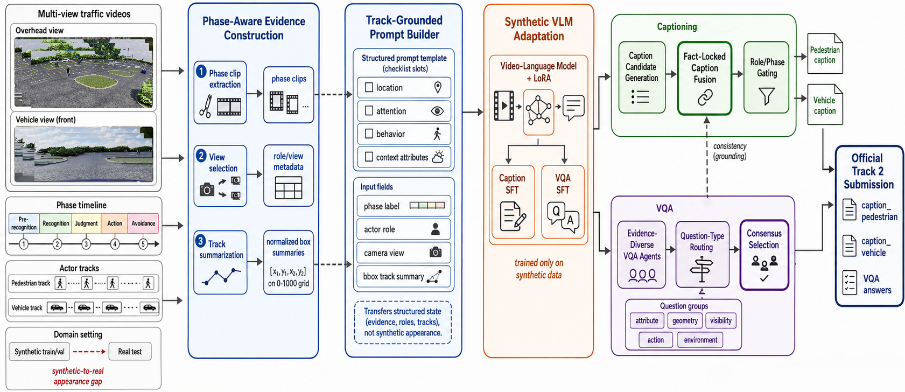

# StateBridge: Phase- and Track-Grounded Reasoning for Synthetic-to-Real Traffic Video Captioning and VQA

This repository is the code release for **StateBridge: Phase- and
Track-Grounded Reasoning for Synthetic-to-Real Traffic Video Captioning and
VQA**, developed for AI City Challenge 2026 Track 2, Transportation Safety
Understanding and Captioning (Sim2Real). The task trains on synthetic SynWTS
videos and evaluates on real WTS traffic videos with two outputs: phase-level
pedestrian/vehicle captions and multiple-choice VQA.

The method transfers structured traffic evidence instead of simulator
appearance. It builds phase-aligned clips, summarizes pedestrian and vehicle
tracks as normalized boxes, fine-tunes public video-language models on
synthetic examples, and combines predictions with fact-locked caption fusion
and evidence-diverse VQA consensus.

## Teaser


[Download the teaser figure as PDF](assets/teaser-pdf.pdf).

## Framework Overview



[Download the framework figure as PDF](assets/overall-framework-synwts.pdf).

## Official Result

The paper reports the following synthetic-only submission:

| Method | S2 | BLEU-4 | METEOR | ROUGE-L | CIDEr | VQA Acc. |
|---|---:|---:|---:|---:|---:|---:|
| StateBridge | 55.4679 | 0.2438 | 0.4248 | 0.4446 | 0.7252 | 81.2930 |

All reported trainable components are adapted only on SynWTS synthetic
train/validation data. Real Track 2 test videos are used only for inference.

## Data Access and Rules

- **Synthetic train/validation data:** [mlcglab/synwts on HuggingFace](https://huggingface.co/datasets/mlcglab/synwts)
- **Real-world test data:** [WTS Dataset on GitHub](https://github.com/woven-visionai/wts-dataset)

Teams must train and fine-tune only on synthetic data. Real-world WTS
training/validation videos and models pretrained on the WTS dataset are not
used by the paper-reported StateBridge pipeline. The SynWTS release contains
only train and validation splits; the challenge test set is the `internal` or
`main` subset of the WTS Dataset. If a downloaded WTS tree also contains the
`BDD_PC_5K` subset, exclude it for this challenge because corresponding
synthetic versions are not included in SynWTS train/validation data.

## Repository Contents

```text
synwts/                    Core Python package
scripts/                   Dataset, fusion, and analysis utilities
configs/release/           Sanitized LLaMA-Factory template configs
docs/                      Extended workflow notes
assets/                    README figures
tests/                     Unit tests for parsing, fusion, facts, and repair
ECCV_AICity26_Track2.pdf   Paper PDF
competition_details.txt    Local copy of the challenge description
```

## Installation

Create a Python environment for the repository:

```bash
conda create -n statebridge python=3.10 -y
conda activate statebridge
python -m pip install --upgrade pip
python -m pip install -e ".[dev,video,metrics]"
```

Install LLaMA-Factory in the same environment for VLM fine-tuning and
prediction:

```bash
git clone https://github.com/hiyouga/LLaMA-Factory.git
cd LLaMA-Factory
python -m pip install -e ".[torch,metrics]"
python -m pip install qwen-vl-utils decord av opencv-python-headless
```

FFmpeg and FFprobe must be available for clip creation:

```bash
ffmpeg -version
ffprobe -version
```

## Expected Data Layout

Set paths for your machine or HPC:

```bash
export ROOT=/path/to/StateBridge
export DATA_ROOT=/path/to/SynWTS
export OUT=/path/to/statebridge_outputs
export LF=/path/to/LLaMA-Factory
export TEST_ROOT=/path/to/official_track2_test_data
```

Synthetic train/validation data should follow this structure:

```text
$DATA_ROOT/
  videos/
    train/
    val/
  annotations/
    caption/
      train/
      val/
    vqa/
      train/
      val/
    bbox_annotated/
      pedestrian/
        train/
        val/
      vehicle/
        train/
        val/
```

The official public test layout is expected to contain:

```text
$TEST_ROOT/
  SubTask1-Caption/
    WTS_DATASET_PUBLIC_TEST/
    WTS_DATASET_PUBLIC_TEST_BBOX/
  SubTask2-VQA/
    WTS_VQA_PUBLIC_TEST.json
```

## Synthetic Dataset Preparation

Build an index over synthetic train/validation scenarios:

```bash
python -m synwts.cli index \
  --dataset-root "$DATA_ROOT" \
  --output "$OUT/full_index.jsonl" \
  --splits train,val
```

Create phase-level clips:

```bash
python -m synwts.cli make-phase-clips \
  --index "$OUT/full_index.jsonl" \
  --output-manifest "$OUT/full_phase_clips.jsonl" \
  --output-root "$OUT/derived" \
  --make-clips \
  --clip-mode mpeg4
```

Export joint caption+VQA SFT data for LLaMA-Factory:

```bash
python -m synwts.cli export-llamafactory \
  --index "$OUT/full_index.jsonl" \
  --output "$LF/data/synwts_train_phase_bbox.json" \
  --dataset-info-output "$OUT/dataset_info_synwts_phase_bbox.json" \
  --dataset-name synwts_train_phase_bbox \
  --tasks caption,vqa \
  --media-policy all \
  --phase-clip-manifest "$OUT/full_phase_clips.jsonl" \
  --bbox-mode summary \
  --frame-width 1920 \
  --frame-height 1080
```

Register the exported dataset in LLaMA-Factory:

```bash
python scripts/merge_dataset_info.py \
  --base "$LF/data/dataset_info.json" \
  --add "$OUT/dataset_info_synwts_phase_bbox.json"
```

## Training

Use the sanitized templates in `configs/release/` and replace placeholder paths:

```bash
cd "$LF"
llamafactory-cli train "$ROOT/configs/release/qwen3vl8b_joint_lora.yaml"
llamafactory-cli train "$ROOT/configs/release/qwen35_9b_joint_lora.yaml"
```

The main reproduced adapters use public models:

```text
Qwen/Qwen3-VL-8B-Instruct
Qwen/Qwen3.5-9B
```

LoRA adapters do not need to be merged for inference. Point
`adapter_name_or_path` to the final adapter directory or to a specific
checkpoint directory.

## Public-Test Inference Data

Build the caption public-test index:

```bash
python -m synwts.cli index-wts-test \
  --test-root "$TEST_ROOT" \
  --output "$OUT/wts_public_test_index.jsonl"
```

Create public-test caption phase clips:

```bash
python -m synwts.cli make-phase-clips \
  --index "$OUT/wts_public_test_index.jsonl" \
  --output-manifest "$OUT/wts_public_test_phase_clips.jsonl" \
  --output-root "$OUT/test_derived" \
  --make-clips \
  --clip-mode mpeg4
```

Export caption inference rows:

```bash
python -m synwts.cli export-llamafactory \
  --index "$OUT/wts_public_test_index.jsonl" \
  --output "$LF/data/wts_public_test_caption.json" \
  --dataset-info-output "$OUT/dataset_info_wts_public_test_caption.json" \
  --dataset-name wts_public_test_caption \
  --tasks caption \
  --media-policy all \
  --phase-clip-manifest "$OUT/wts_public_test_phase_clips.jsonl" \
  --bbox-mode summary \
  --frame-width 1920 \
  --frame-height 1080
```

Export VQA inference rows:

```bash
python -m synwts.cli export-wts-test-vqa \
  --test-root "$TEST_ROOT" \
  --vqa-json "$TEST_ROOT/SubTask2-VQA/WTS_VQA_PUBLIC_TEST.json" \
  --output "$LF/data/wts_public_test_vqa_fast.json" \
  --dataset-info-output "$OUT/dataset_info_wts_public_test_vqa_fast.json" \
  --dataset-name wts_public_test_vqa_fast \
  --clip-output-root "$OUT/test_derived/vqa_clips" \
  --make-clips \
  --clip-mode mpeg4 \
  --bbox-mode summary \
  --frame-width 1920 \
  --frame-height 1080 \
  --max-videos-per-row 2 \
  --env-clip-duration 6
```

Register both public-test datasets in LLaMA-Factory with
`scripts/merge_dataset_info.py`.

## Prediction

Run LLaMA-Factory prediction with the release templates:

```bash
cd "$LF"
llamafactory-cli train "$ROOT/configs/release/predict_qwen35_9b_caption.yaml"
llamafactory-cli train "$ROOT/configs/release/predict_qwen35_9b_vqa.yaml"
```

LLaMA-Factory uses the `train` command for `do_predict: true` configs. The
generated outputs are written under the configured `output_dir`.

Assemble official JSON files:

```bash
python -m synwts.cli assemble-caption \
  --inference-dataset "$LF/data/wts_public_test_caption.json" \
  --predictions "$OUT/predict/qwen35_9b_joint_caption/generated_predictions.jsonl" \
  --output "$OUT/submission/caption_submission.json"

python -m synwts.cli assemble-vqa \
  --inference-dataset "$LF/data/wts_public_test_vqa_fast.json" \
  --predictions "$OUT/predict/qwen35_9b_joint_vqa/generated_predictions.jsonl" \
  --output "$OUT/submission/vqa_submission.json"
```

Validate before submission:

```bash
python -m synwts.cli validate-caption \
  --predictions "$OUT/submission/caption_submission.json"

python -m synwts.cli validate-vqa \
  --predictions "$OUT/submission/vqa_submission.json"
```

Zip the two required files:

```bash
cd "$OUT/submission"
zip statebridge_submission.zip caption_submission.json vqa_submission.json
```

## Fusion and Analysis

StateBridge includes several post-training tools:

```bash
python -m synwts.cli ensemble-vqa --help
python -m synwts.cli fuse-caption --help
python -m synwts.cli augment-caption-facts --help
python -m synwts.cli rerank-caption-cider-bank --help
```

These tools operate on model predictions and synthetic-derived facts. They do
not require additional real-world training labels.

## Tests

Run the unit tests from the repository root:

```bash
python -m pytest tests
```

The unit tests use small synthetic fixtures and do not require the full
challenge dataset.

## Reproducibility Notes

- Use only public pretrained models and synthetic SynWTS supervision for the
  paper-reported training pipeline.
- Use real WTS public-test videos only for inference and qualitative examples.
- Do not commit downloaded challenge videos, generated clips, checkpoints,
  prediction files, or submission archives.
- Keep adapter paths and dataset paths machine-local. The public configs in
  `configs/release/` use placeholders by design.

## Citation

```bibtex
@inproceedings{statebridge2026,
  title     = {StateBridge: Phase- and Track-Grounded Reasoning for Synthetic-to-Real Traffic Video Captioning and VQA},
  author    = {SMART Lab},
  booktitle = {AI City Challenge Workshop, ECCV},
  year      = {2026}
}
```
